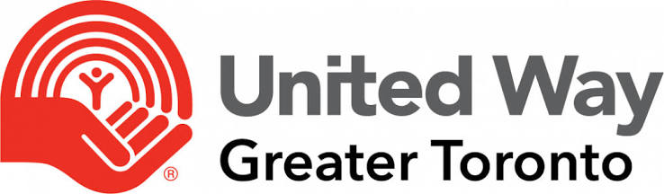

<html lang="en">
<head>
<meta charset="UTF-8">
<meta name="viewport" content="width=device-width, initial-scale=1.0">

<title>United Way Greater Toronto</title> 

</head>

<body>

<header>

<nav>

    <!-- Replace logo.png with your actual image file name -->
    

<ul>

<li>
<a href="#">Home</a>
</li>

<li>
<a href="#">Our Work</a>
</li>

<li>
<a href="#">Programs</a>
</li>

<li>
<a href="#">Contact</a>
</li>

</ul>

</nav>

</header>

<section class="hero">

<h1>
Building a GTA for all
</h1>

It takes unwavering determination and hard work to ensure the issues facing our community today don't define our future. Together we build stronger communities across Peel, Toronto and York Region.

<a href="#" class="btn">
Learn More
</a>

</section>

<section>

<h2>
Supporting Local Communities
</h2>

We partner with community organizations to improve access to education,
healthcare, food security, and social services. Every initiative is designed
to create lasting impact and stronger neighbourhoods.

 

Together with volunteers, donors, and local leaders, we help people build
better futures through sustainable community programs.

</section>

<section class="stats">

<h2>
250+
</h2>

Community Projects

<h2>
15K
</h2>

Lives Supported

<h2>
500+
</h2>

Volunteers

</section>

<section>

<h2 style="text-align:center;margin-bottom:50px;font-size:40px;">
Our Focus Areas
</h2>

<h3>
Education
</h3>

Creating opportunities for lifelong learning and youth development.

<h3>
Health
</h3>

Improving access to wellness programs and community health initiatives.

<h3>
Food Security
</h3>

Supporting families with essential resources and local food programs.

</section>

<section class="cta">

<h2 style="font-size:42px;margin-bottom:20px;">

Together We Can Create Lasting Change

</h2>

Join our community of partners, volunteers, and supporters working together to build stronger and more inclusive communities.

<a class="btn" href="#">

Get Involved

</a>

</section>

<footer>

© 2026 United Way Greater Toronto • AI Demo Page

</footer>

</body>

</html>
